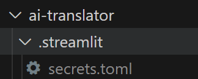

### 一、项目说明
---
&emsp;本项目希望提供一个APP供用户翻译pdf文档。<br>
注意：目前暂不支持扫描文档

### 二、APP设计


### 三、模块结构说明
1. utils
    logger.py 打印日志的工具类，支持定义日志级别
    config_loader.py 加载配置文件config.yaml
2. ai_model
    该模块主要定义prompt和实现千帆、openapi等调用。
3. file
    文档抽象为File、Page、Content，File包含多个Page，Page包含Content,Content包含多种类型，文字、表格和图片
4. fonts
    字体包，用于写出翻译文字
5. tanslator
    pdf_tanslator.py是适配器，负责加载pdf并调用大模型进行翻译
    exceptions.py定义自定义的异常类
    pdf_parse.py将pdf转换为File
    writer.py支持写出为pdf或者markdown格式
6. xxx


### 使用示例

您可以通过指定配置文件或提供命令行参数来使用 OpenAI-翻译器。

#### 使用配置文件

根据您的设置调整 `config.yaml` 文件：

```yaml
SparkModel:
  model: "lite"
  api_key: "your key"
  secret_key: "your key"
  app_id: "your id"

common:
  book: "tests/test.pdf"
  file_format: "markdown"
```

然后命令行直接运行：

```bash
python ai_translator/main.py
```

#### 使用命令行参数

您也可以直接在命令行上指定设置。这是使用 星火大模型的例子：

```bash
# 将您的 api_key 设置为环境变量
python main.py --model_type SparkModel --openapi_api_key your key --openapi_secret_key  your key --openapi_app_id  your id --file_format markdown --book tests/test.pdf --openpai_model lite
```

建议使用streamlit启动：


# 通过streamlit启动
前提，在这个目录下面我们要创建.streamlit目录，并且把密码维护到secrets.toml项目下面

```yaml
[SparkModel]
model_type="SparkModel"
openpai_model="lite"
openapi_api_key= "your key"
openapi_secret_key= "your secret key"
openapi_app_id= "your id"
```

```bash
 streamlit run .\streamlit_app.py
```